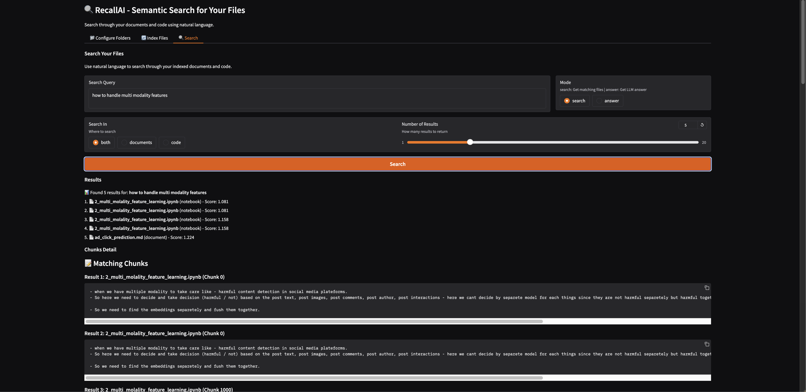
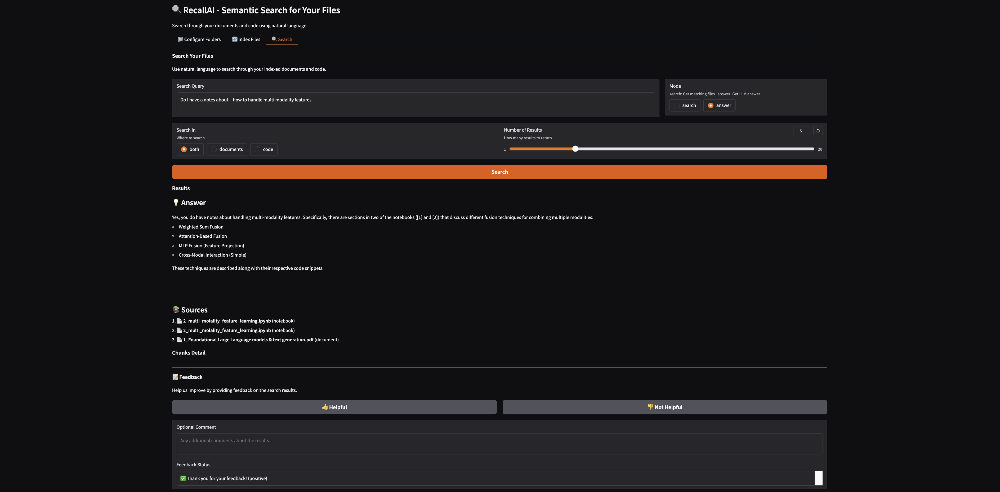

# RecallAI

**Intelligent local file search powered by semantic embeddings and LLMs** - Search your documents and code using natural language, completely offline.


## What is RecallAI?

RecallAI transforms your local files into a searchable knowledge base. It uses semantic embeddings to understand the *meaning* of your content, not just keywords. Ask questions in natural language and get AI-powered answers with source citations—all running locally on your machine.

## Features

- 🔍 **Semantic Search** - Find content by meaning, not just keywords
- 🤖 **AI Answers** - Get natural language answers powered by Llama 3.1 8B
- 💾 **100% Local** - No cloud, no tracking, complete privacy
- ⚡ **Fast Queries** - Pre-computed embeddings for instant results
- 📝 **Multiple Formats** - Documents (`.txt`, `.md`, `.pdf`), Code (`.py`), Notebooks (`.ipynb`)
- 🔄 **Incremental Indexing** - Only re-processes changed files
- 📊 **Dual Embedding Models** - Specialized embeddings for documents (384-dim) and code (768-dim)
- 🖥️ **Simple UI** - Clean Gradio interface with feedback system
- 🔌 **REST API** - Full-featured API for programmatic access

## Performance

- ⚡ **Indexing**: ~100-500 files/minute (depends on file size)
- 🔍 **Search**: <100ms for most queries
- 🤖 **Answer Generation**: 20-40 seconds (LLM inference on CPU)
- 💾 **Memory**: ~2GB for embedders + indexes (varies by corpus size) + ~4GB LLM Model

## Design Principles

- 🔒 **Offline-First** - No cloud dependencies, complete privacy
- ⚡ **Pre-Indexed** - Embeddings computed upfront for speed
- 🔄 **Incremental** - Only re-process changed files
- ✨ **Simple** - Clean architecture, no over-engineering
- 🚀 **Fast** - Optimized for low-latency queries

## Design and Design Decisions

📐📐📐 See [docs/designs.md](docs/designs.md) for detailed design decisions and architecture choices.

## Architecture

TODO


## Quick Start

- **Native Setup (Recommended)**: See [QUICKSTART.md](QUICKSTART.md)
- **Docker Setup**: See [DOCKER.md](DOCKER.md)

## Search Modes

### Search Mode
Returns ranked files with matching chunks. Perfect for finding specific information.

**Example:**


### Answer Mode
Uses the local LLM to generate natural language answers with source citations.

**Example:**


**🧠🧠🧠You can leave a feedback which will be used for natural labling and monitoring**

## How It Works


## Requirements

- **Python**: 3.11 or higher
- **RAM**: ~8GB recommended
- **Disk**:
  - ~500MB for dependencies
  - ~4.5GB for LLM model
  - Variable for indexes (depends on your files)
- **OS**: macOS or Linux (Windows via WSL)

## Troubleshooting

### Ollama Connection Error
```bash
# Check if Ollama is running
ollama list

# Start Ollama if needed
ollama serve
```

### Model Not Found (404)
```bash
# Pull the model
ollama pull llama3.1:8b-instruct-q4_0
```

### Indexing Fails
- Check folder paths in `config.yaml`
- Ensure you have read permissions
- Check logs in `logs/recallai.log`

### Slow Performance
- Reduce `top_k` in search
- Use "search" mode instead of "answer" mode
- Increase RAM allocation if using Docker


## Documentation

- [API Reference](docs/API.md) - Complete REST API documentation
- [Docker Guide](DOCKER.md) - Container deployment
- [Quick Start](QUICKSTART.md) - Detailed setup guide
- [Requirements](REQUIREMENTS.md) - Full project specification

## Contributing

This is a learning project built to explore semantic search and local LLMs. Contributions, issues, and feature requests are welcome!

## License

MIT License - see [LICENSE](LICENSE) file for details.

## Acknowledgments

- [Sentence Transformers](https://www.sbert.net/) for document embeddings
- [Jina AI](https://jina.ai/) for code embeddings
- [FAISS](https://github.com/facebookresearch/faiss) by Meta for vector search
- [Ollama](https://ollama.ai/) for local LLM runtime
- [LangChain](https://www.langchain.com/) for text processing utilities

---

**Made with ❤️ for local-first AI**
