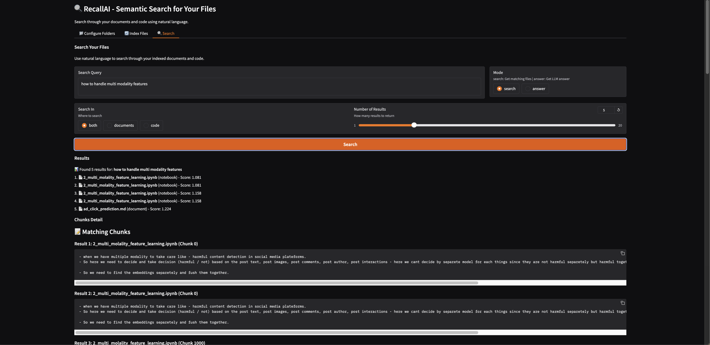
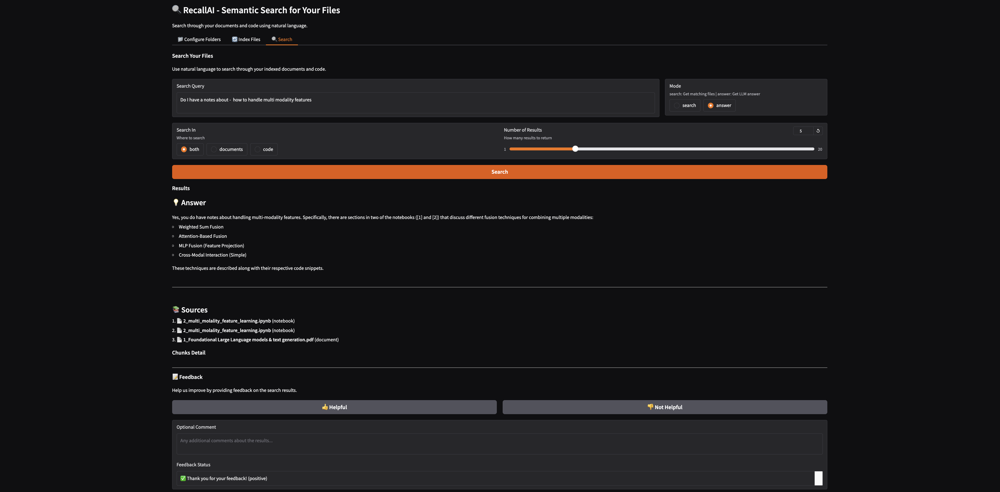

# RecallAI

**Intelligent local file search powered by semantic embeddings and LLMs** - Search your documents and code using natural language, completely offline.


## What is RecallAI?

RecallAI transforms your local files into a searchable knowledge base. It uses semantic embeddings to understand the *meaning* of your content, not just keywords. Ask questions in natural language and get AI-powered answers with source citations—all running locally on your machine.

## Features

- 🔍 **Semantic Search** - Find content by meaning, not just keywords
- 🤖 **AI Answers** - Get natural language answers powered by Llama 3.1 8B
- 💾 **100% Local** - No cloud, no tracking, complete privacy
- ⚡ **Fast Queries** - Pre-computed embeddings for instant results
- 📝 **Multiple Formats** - Documents (`.txt`, `.md`, `.pdf`), Code (`.py`), Notebooks (`.ipynb`)
- 🔄 **Incremental Indexing** - Only re-processes changed files
- 📊 **Dual Embedding Models** - Specialized embeddings for documents (384-dim) and code (768-dim)

## Design and Design Decisions

### Architecture Decision Records (ADRs)

| ADR | Decision | Description |
|-----|----------|-------------|
| [ADR-001](docs/decisions/ADR_001_vector_store_selection.md) | Vector Store Selection | Chose FAISS for offline, local vector search with minimal overhead |
| [ADR-002](docs/decisions/ADR_002_embeddings_selection.md) | Embedding Strategy | Dual-index approach for documents and code with separate embeddings |
| [ADR-003](docs/decisions/ADR_003_embedding_models_selection.md) | Embedding Models | Selected MiniLM-L6 (384-dim) for docs, Jina-v2 (768-dim) for code |
| [ADR-004](docs/decisions/ADR_004_how_to_handle_code_files.md) | Code & Notebook Ingestion | Strategy for handling .py files and .ipynb with mixed content |
| [ADR-005](docs/decisions/ADR_005_re-indeing_stratergy_selection.md) | Re-indexing Strategy | Incremental indexing using file hashes to skip unchanged files |
| [ADR-006](docs/decisions/ADR_006_FLAT_vs_HNSW.md) | FAISS Index Type | Chose HNSW over Flat for scalability and speed-accuracy tradeoff |
| [ADR-007](docs/decisions/ADR_007_llm_model_selection.md) | LLM Model Selection | Selected llama3.1:8b-instruct with q4_0 quantization for local inference |
| [ADR-008](docs/decisions/ADR_008_caching_decision.md) | Caching Strategy | Rejected caching (Redis/in-memory) due to low hit rate and re-indexing |

📐 See [docs/decisions](docs/decisions) for more details.
📐 See [docs/designs.md](docs/designs.md) for detailed design flows and diagrams.

## Performance Benchmarks

### Search Mode Latency

| Metric | Value | Description |
|--------|-------|-------------|
| **Min** | 6.96ms | Fastest query response |
| **P50** | 9.70ms | Median (50% of queries faster) |
| **Mean** | 9.96ms | Average response time |
| **P90** | 11.13ms | 90% of queries faster than this |
| **P95** | 11.66ms | 95% of queries faster than this |
| **Max** | 33.24ms | Slowest query response |

*Based on 160 test runs. Pure API performance without UI overhead.*

### Answer Mode Latency

| Metric | Value | Description |
|--------|-------|-------------|
| **Min** | 628ms | Fastest LLM response |
| **P50** | 2.41s | Median (50% of queries faster) |
| **Mean** | 2.62s | Average response time |
| **P90** | 4.65s | 90% of queries faster than this |
| **P95** | 4.80s | 95% of queries faster than this |
| **Max** | 5.59s | Slowest LLM response |

*Based on 48 test runs. Includes semantic search + LLM inference time.*

**Note**: Browser UI adds ~75-150ms overhead for search mode due to Gradio framework and rendering. For answer mode, this overhead is negligible compared to LLM inference time.

## Architecture

TODO

## Performance

- ⚡ **Indexing**: ~100-500 files/minute (depends on file size)
- 🔍 **Search**: <100ms for most queries
- 🤖 **Answer Generation**: 20-40 seconds (LLM inference on CPU)
- 💾 **Memory**: ~2GB for embedders + indexes (varies by corpus size) + ~4GB LLM Model

## Design Principles

- 🔒 **Offline-First** - No cloud dependencies, complete privacy
- ⚡ **Pre-Indexed** - Embeddings computed upfront for speed
- 🔄 **Incremental** - Only re-process changed files
- ✨ **Simple** - Clean architecture, no over-engineering
- 🚀 **Fast** - Optimized for low-latency queries


## Quick Start

- **Native Setup (Recommended)**: See [QUICKSTART.md](QUICKSTART.md)
- **Docker Setup**: See [DOCKER.md](DOCKER.md)

## Search Modes

### Search Mode
Returns ranked files with matching chunks. Perfect for finding specific information.

**Example:**


### Answer Mode
Uses the local LLM to generate natural language answers with source citations.

**Example:**


💡 **Pro tip:** You can leave feedback (👍/👎) on results to help improve the system! - This will be used for natural labeling and monitoring.

## Requirements

- **Python**: 3.11 or higher
- **RAM**: ~8GB recommended
- **Disk**:
  - ~500MB for dependencies
  - ~4.5GB for LLM model
  - Variable for indexes (depends on your files)
- **OS**: macOS or Linux (Windows via WSL)

## Troubleshooting

### Ollama Connection Error
```bash
# Check if Ollama is running
ollama list

# Start Ollama if needed
ollama serve
```

### Model Not Found (404)
```bash
# Pull the model
ollama pull llama3.1:8b-instruct-q4_0
```

### Indexing Fails
- Check folder paths in `config.yaml`
- Ensure you have read permissions
- Check logs in `logs/recallai.log`

### Slow Performance
- Reduce `top_k` in search
- Use "search" mode instead of "answer" mode
- Increase RAM allocation if using Docker

## Contributing

This is a learning project built to explore semantic search and local LLMs. Contributions, issues, and feature requests are welcome!